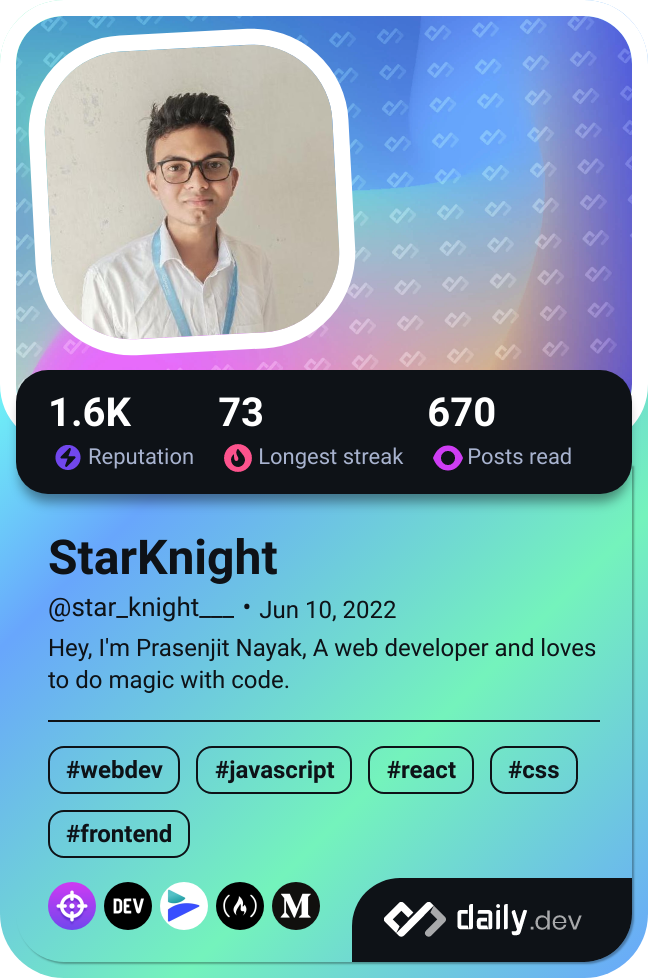

<div>


[](https://wakatime.com/@d27d27da-dc32-4c1b-a703-f654f405010)


</div>  

## Coding Status: 
<!--START_SECTION:waka-->

```txt
From: 04 June 2023 - To: 26 July 2024

Total Time: 396 hrs 29 mins

JavaScript        170 hrs 16 mins ██████████▓░░░░░░░░░░░░░░   42.82 %
CSS               92 hrs 12 mins  █████▓░░░░░░░░░░░░░░░░░░░   23.19 %
HTML              86 hrs 20 mins  █████▒░░░░░░░░░░░░░░░░░░░   21.71 %
Markdown          17 hrs 6 mins   █░░░░░░░░░░░░░░░░░░░░░░░░   04.30 %
Java              13 hrs 20 mins  █░░░░░░░░░░░░░░░░░░░░░░░░   03.36 %
```

<!--END_SECTION:waka-->

# Namaste I'm Prasen 🙏🏻
- Hello! I'm Prasenjit Nayak 👨🏻‍💻, a B.Tech 🎓student 👨🏻‍🎓 on a journey of continuous learning 📑.
- I'm currently focusing on learning Java and Web Development 🍵 while improving my communication 🗣️ and programming skills ⌨️. 
- I love to read books 📚 in my spare time 🪹.
- I'm open to collaborating 🫂, discussing projects 📒, and connecting with fellow learners 🤓. Let's grow 📈 and learn 🙎🏻‍♂️ together!

## Skills - Language and tools
[](https://skillicons.dev)
<!--social stats -->

### StackOverflow
<a href="https://stackoverflow.com/users/22008549/star-knight"></a>

## Let's connect -
- 💼 Social Accounts: [Prasenjit Nayak](https://t.co/oujYu4Scht) <br>

## DevCard -

<a href="https://app.daily.dev/star_knight___"></a>

<!-- End of the README files :) --!>
