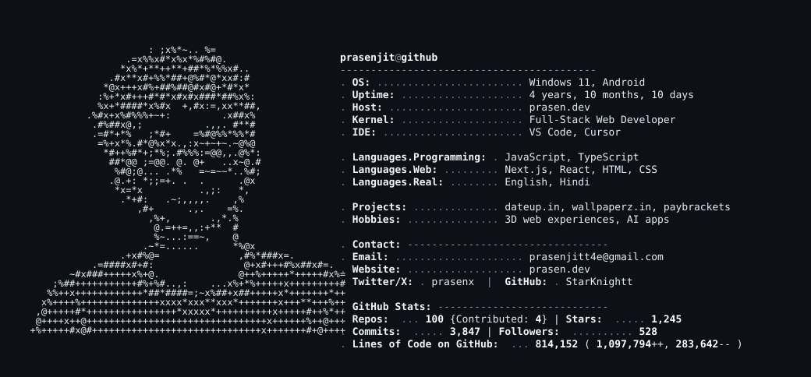

<picture>
  <source media="(prefers-color-scheme: dark)" srcset="dark_mode.svg">
  <source media="(prefers-color-scheme: light)" srcset="light_mode.svg">
  
</picture>

## About me

[Prasenjit Nayak](https://prasen.dev)

## Cool Stuffs :)
· [Next.Js Learn](https://learn.prasen.dev) - Learn NextJs  
· [dateup.in](https://dateup.in) - AI Dating profile enhancer  
· [wallpaperz.in](https://wallpaperz.in) - Wallpapers with AI image gen  
· [cleantype](https://clean-type.vercel.app) - Notes taking  
· [Buddy-Finder](https://buddy-find.vercel.app/) - Find your GitHub buddy  
· [Backroom-Espace](https://backroom-escape.vercel.app/) - Play Game  
· [Paybracket](https://paybrackets.com/) - Count $ take-home pay  
· [Jungle-Experience](https://starknightt.github.io/jungle-trail/) - 3D jungle experience in browser  
· [Night-Street](https://night-street.vercel.app/) - A night street Experience in browser

## Latest Blog Posts
<!-- BLOG-POSTS:START -->
<!-- BLOG-POSTS:END -->

## Coding Stats
<!--START_SECTION:waka-->
<!--END_SECTION:waka-->
